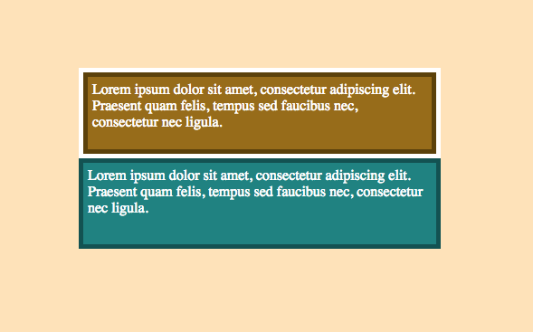

## Задание

Нека имаме 2 div елемента (първият с ID #container1, а вторият с ID #container2), които съдържат някакъв текст.
Тези 2 div-a са поставени в контейнер и трябва запълнят пространството в контейнера, като изпълнят следните изисквания:

- #container1:
    - Да има padding 5px от всички страни.
    - Да има margin 5px от всички страни.
    - Да има border със следните стойности:
        - дебелина: 5px
        - плътност: solid
        - цвят: #5b4000
    - Крайните размери на box-model-a трябва да бъдат 400px ширина и 100px виосчина.

- #container2:
    - Да има padding 5px от всички страни.
    - Да има border със следните стойности:
        - дебелина: 5px
        - плътност: solid
        - цвят: #0e5252
    - Крайните размери на box-model-a трябва да бъдат 400px ширина и 100px виосчина.
    - **Внимание!** този контейнер има предварително зададена ширина от 100%. Property-то width да не се предефинира.

При правилно решаване на задачата трябва да получите следното:

